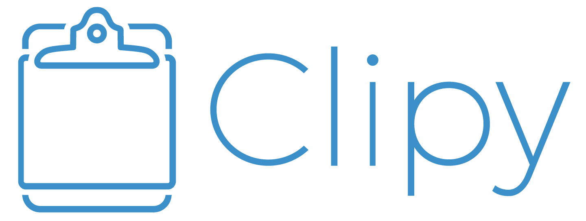

  

 

# CopyUp

CopyUp is a clipboard manager for macOS.

## Requirements

- macOS 13 Ventura or later
- Xcode 26.5 or later

## Build

macOS checks Accessibility permission by the app's code signature. If CopyUp is
built without a stable signing certificate, macOS may ask for Accessibility
permission again for every build.

1. Open `CopyUp.xcodeproj` in Xcode.
2. Select the `CopyUp` scheme.
3. Build and run on `My Mac`.

If you want to use Firebase features, place your own `GoogleService-Info.plist`
in `CopyUp/GoogleService`. This file is not required for local builds without
Firebase.

## Distribution

- Bundle ID: `tech.beisi.copyup`
- Debug Bundle ID: `tech.beisi.copyup.debug`
- Update feed: `https://copyup.beisi.tech/appcast.xml`

For direct distribution outside the Mac App Store, use Developer ID signing and
Apple notarization.

## Privacy

Please see [PRIVACY.md](./PRIVACY.md) for information about local data storage,
network communication, analytics, and crash reporting.

## Attribution

CopyUp is derived from the open-source Clipy project and follows the MIT license.
See [LICENSE](./LICENSE) for the original copyright notice.
